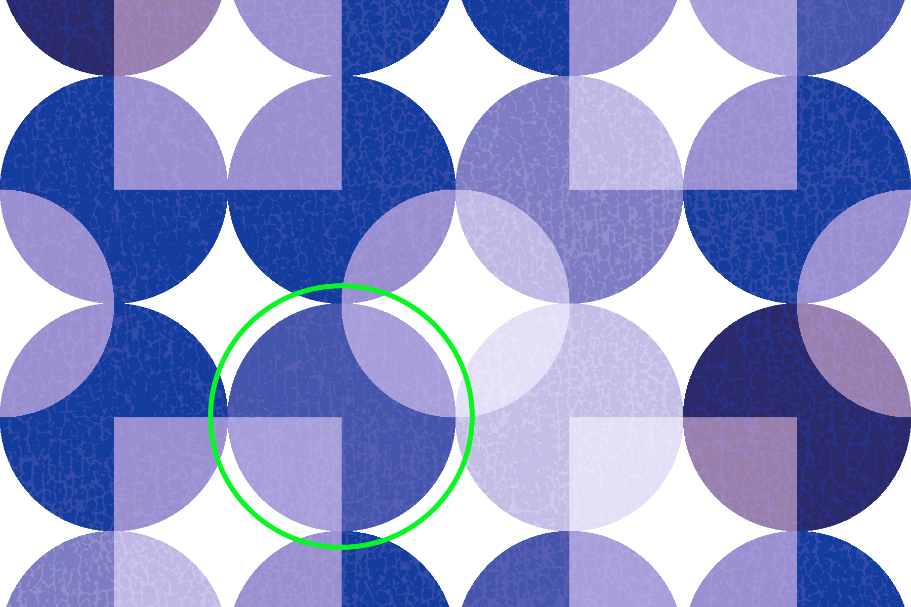
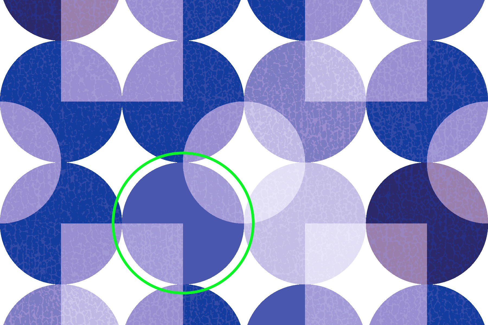
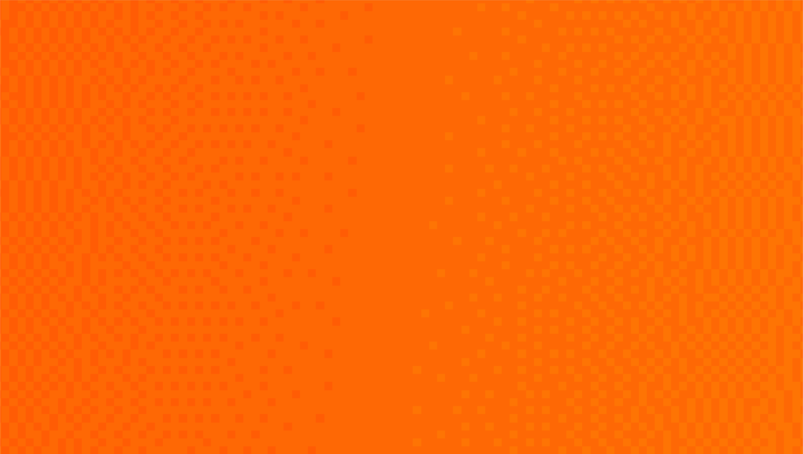
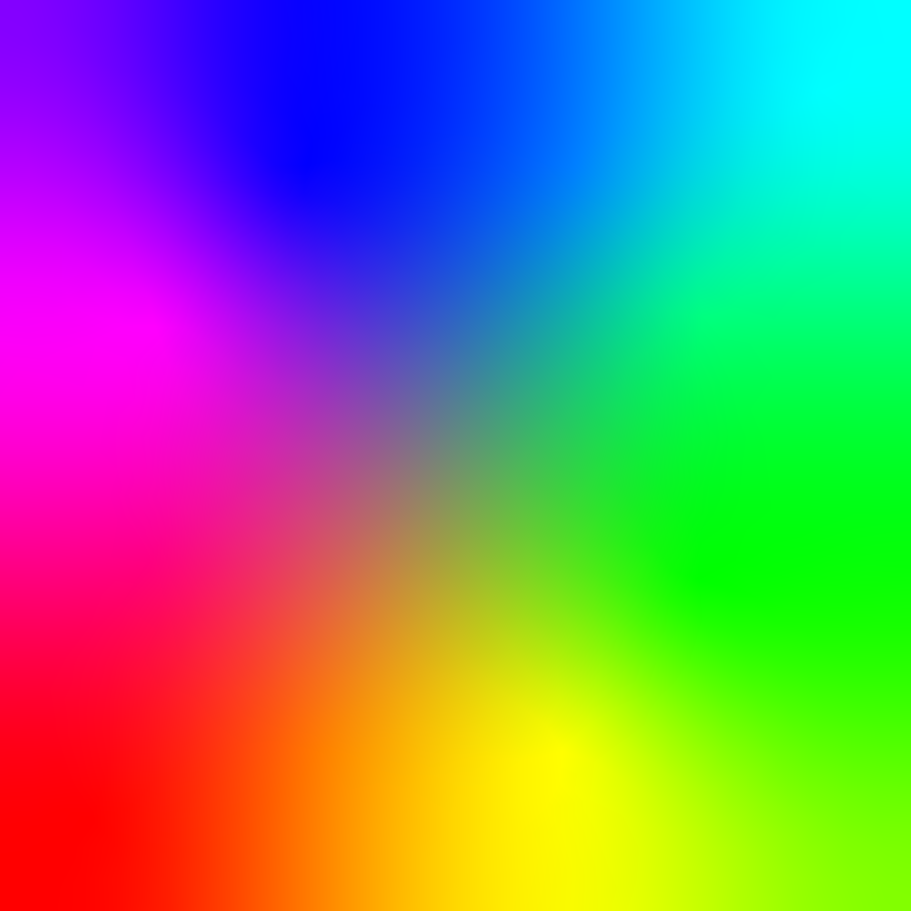
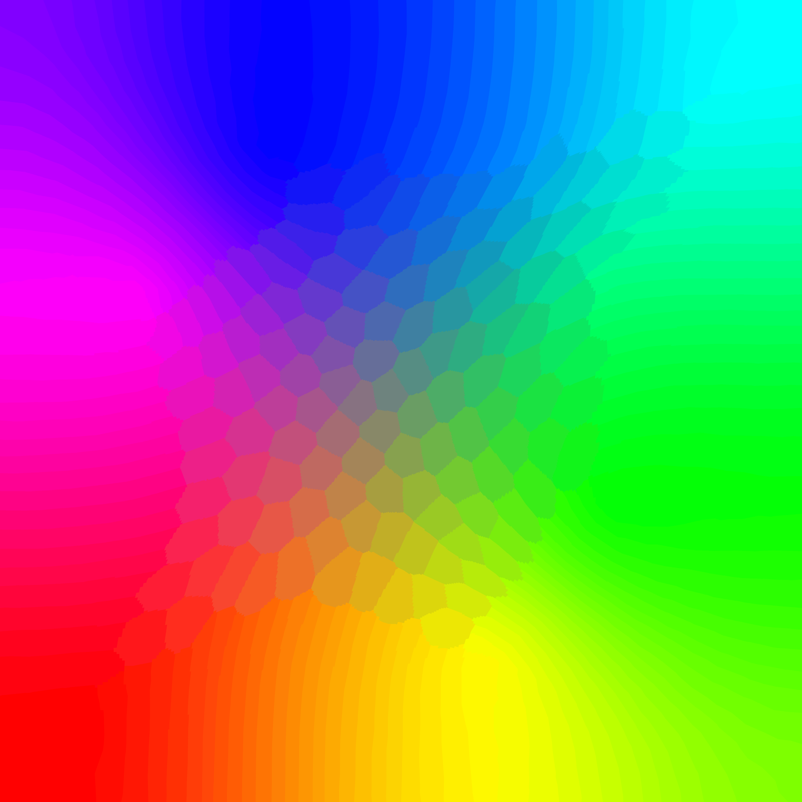

# IMGquant

Quantize is how online services reduce file sizes by 60% to 80%. 

[Bit depth](https://www.cambridgeincolour.com/tutorials/bit-depth.htm) describes how much information an image can contain. The higher the bit depth, the more colors an image can have and the larger the file size can be.

[Quantization](https://en.wikipedia.org/wiki/Quantization_(image_processing)) converts higher bit-depth images to 8-bit images with a maximum of 256 colors, or lower.

If quantization is right for your images, it yields significantly smaller files than compression, downscaling, and other reduction methods.

## Usage

```
py IMGquant.py --help

# Default 256 colors, 1.0 dither, 9 zlib
py IMGquant.py "D:\CornDoggSoup\IMGsqueeze\test-images\jpeg"

# Options
py IMGquant.py --colors 64 --dither 0.5 --zlib 7 "D:\CornDoggSoup\IMGsqueeze\test-images\jpeg"
```

## Using a design app?

If you're working with source images and a design app, it's worth comparing the app's export options to IMGquant results. For example, a PNG may be exportable as: 

* 32-bit RGBa - Full color + transparency
* 24-bit RGB - Full color + no transparency
* 8-bit RGBa or RGB - 256 colors with/out transparency
* 1-bit - black and white

So a comparison would be: 

* Export PNG as usual - 24-bit or 32-bit - and then quantize with PNGSqueeze
* Export PNG directly to 8-bit

Which method works better will depend on the art, app, and results you want.

## The Algorithm

In most cases, I've made Pillow's baked-in options available in IMGsqueeze. One notable exception is using the LIBIMAGEQUANT algorithm instead of allowing the choice of LIBIMAGEQUANT or FASTOCTREE.  There are 2 reasons for this. First is that LIBIMAGEQUANT does a significantly better job with details, as illustrated below

**Source image**  


**FASTOCTREE**  


**LIBIMAGEQUANT**  


## Colors

A quantized image can contain up to 256 colors (8-bit) - but it doesn't have to. Say you have a logo with 3 colors - selecting 4 max colors can result in a smaller file. Similarly, a grayscale image has just 1 color and is 1-bit. 

The IMGquant default is 256 colors. Use the `--colors` option to set a different value. 

## Dither

Dither is the level of halftones applied to gradients. Dither is expressed as a float from 0.00 (no dither) to 1.00 (full halftones). 

The IMGquant default is 1.00. Use the `--dither` option to set a different value. Here's what dither looks like close up:



Pillow has a baked in `.quantize()` method, however this method has crappy dithering - either none or Floyd-Steinberg. 

The second reason I chose LIBIMAGEQUANT is because it has its own method which includes full dither control. 

**Source image**  


**No Dither**  


**Full Dither**


## ZLIB Compression

By default, when an image is quantized it is also [compressed with Zlib](zlib.md). Use the `--zlib 0` option to disable compression. 

## Tech Notes

```
0 = MEDIANCUT = Default non-RGBa
1 = MAXCOVERAGE = Best non-RGBa
2 = FASTOCTREE = Default RGBa
3 = LIBIMAGEQUANT = Best RGBa

PIL.features.check_feature(libimagequant)

from PIL import Image
import imagequant

input_image = Image.open("./example.png")
output_image = imagequant.quantize_pil_image(
    input_image,
    dithering_level=1.0,  # from 0.0 to 1.0
    max_colors=256,       # from 1 to 256
)

output_image.save("./out.png", format="PNG")
```

## Resources

* https://en.wikipedia.org/wiki/Quantization_(image_processing)
* https://en.wikipedia.org/wiki/Median_cut
* https://pillow.readthedocs.io/en/stable/reference/Image.html?highlight=quantize#quantization-methods
* https://pillow.readthedocs.io/en/stable/reference/Image.html#PIL.Image.Image.quantize
* https://pillow.readthedocs.io/en/stable/reference/features.html#features

